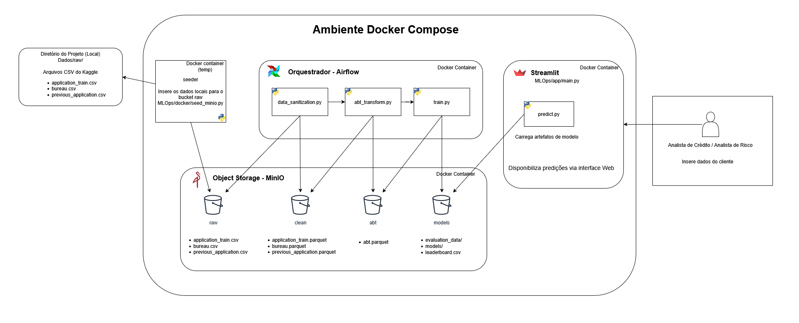

# Projeto final do módulo de AI/ML da LabData FIA: Home Credit Default Risk

- **Contexto**: O Home Credit, empresa que oferece empréstimos para clientes com pouco ou nenhum histórico de crédito, enfrenta o desafio de equilibrar a concessão de crédito com a minimização da inadimplência.
- **A "Dor" do Negócio**: A análise manual ou baseada em regras simples de crédito é lenta e falha em capturar padrões complexos de risco, resultando em perda de receita (clientes bons negados) ou aumento de prejuízo (clientes inadimplentes aprovados).
- **Objetivo**: Desenvolver um modelo de Machine Learning preditivo capaz de classificar a probabilidade de inadimplência de um solicitante, permitindo uma tomada de decisão automatizada, mais rápida e mais precisa.
- **Impacto Esperado**: Aumentar a rentabilidade da carteira de crédito e promover a inclusão financeira de forma sustentável para o negócio.

Base: [Home Credit Default Risk (Kaggle)](https://www.kaggle.com/competitions/home-credit-default-risk/overview) — variável alvo `TARGET` (~8% de inadimplência). Métrica oficial: **ROC AUC**.

## Arquitetura da solução



O projeto segue o framework **CRISP-DM** e é organizado como um pipeline em
camadas — cada estágio lê a saída do anterior, com todo o I/O nos buckets do
**MinIO (S3)** e orquestração no **Airflow**:

```
Dados/raw/*.csv (host) --seeder-->                MinIO(raw)
MinIO(raw)   --[DAG: data-sanitization]-->  MinIO(clean/*.parquet)
MinIO(clean) --[DAG: build-abt]--------->   MinIO(abt/abt.parquet)
MinIO(abt)   --[DAG: train-model]------->   MinIO(models/…/model.pkl)
MinIO(models) --[Streamlit: predict.py]->   decisão de crédito (:8501)
MinIO(models) --[DAG: check-monitoring]->   MinIO(monitoring/) → re-treino por drift
```

Resumo da metodologia:

1. **Sanitização** (`DataPipeline/data_sanitization.py`) — limpeza dos CSVs brutos
   (nulos estruturais, sentinelas, valores impossíveis), sem imputação.
2. **ABT** (`DataPipeline/abt_transform.py`) — agregação das tabelas auxiliares
   (`bureau`, `previous_application`) para uma linha por empréstimo + razões
   financeiras (`CREDIT_INCOME_RATIO`, `DTI_RATIO`, …).
3. **Treino** (`Model/train.py`) — split estratificado treino/validação/teste com
   imputação por mediana **calculada só no treino** (sem vazamento); compara
   XGBoost, Random Forest e Regressão Logística com rebalanceamento de classe e
   publica o campeão por AUC no `leaderboard.csv`.
4. **Serviço de predição** (`MLOps/app/main.py` + `Model/predict.py`) — Streamlit
   com regras de negócio antes do modelo e ação automática por faixa de score.
5. **Monitoramento** (`Model/monitoring.py` + DAG `home-credit-monitoring`) —
   performance (ROC AUC/KS/precisão-recall) e data drift (PSI), com re-treino
   automático quando os limiares estouram.

Detalhes de infra (componentes, DAGs, monitoramento e ações automatizadas):
[MLOps/README.md](MLOps/README.md).

### Estrutura do repositório

| Pasta | Conteúdo |
|---|---|
| `DataPipeline/` | Scripts de limpeza e ABT + `config.yml` do domínio de dados + notebooks de EDA |
| `Model/` | `train.py`, `predict.py`, `monitoring.py`, `evaluation.ipynb` + `config.yml` do domínio de modelo |
| `MLOps/` | DAGs do Airflow, serviço Streamlit, Dockerfiles, `pipeline_orchestration.py`, README de arquitetura |
| `Dados/` | Camadas locais (`raw/`, `clean/`, `abt/`) — apenas entrada do seeder; o pipeline usa o MinIO |
| `storage.py` | Helper de I/O S3/MinIO usado por todo o pipeline |

## Pré-Requisitos

* Python 3.12
[](https://www.python.org/downloads/)

* Docker
[](https://www.docker.com/)

## 🚀 Primeiros Passos

```bash
# Para começar, clone o repositório em sua máquina local:
git clone https://github.com/luccascruz/projeto-ml-labdata.git

# Entre no seu projeto:
cd projeto-ml-labdata
```

### Dados

Baixe a base do Kaggle (<https://www.kaggle.com/competitions/home-credit-default-risk/overview>)
e coloque os CSVs **brutos** na pasta `Dados/raw/`:
`application_train.csv`, `bureau.csv`, `previous_application.csv`.

O serviço `seeder` do Docker envia esses arquivos para o bucket `raw` do MinIO
automaticamente ao subir o stack (se os arquivos já estiverem no bucket, o
seeder é idempotente e não precisa deles no host).

## Rodar via Docker (forma recomendada)

Via reproduzível (Linux/macOS/Windows) que sobe MinIO + Airflow + Streamlit e
roda o pipeline `raw → clean → abt → train` orquestrado:

```bash
docker compose up -d --build   # primeira vez (constrói as imagens)
docker compose up -d           # próximas vezes
```

Acessos:

| Serviço | URL | Credenciais |
|---|---|---|
| MinIO (console) | <http://localhost:9001> | `minioadmin` / `minioadmin123` |
| Airflow | <http://localhost:8080> | `admin` / `admin` |
| Streamlit | <http://localhost:8501> | — |

Dispare o DAG `home-credit-pipeline` na UI do Airflow, ou pela linha de comando:

```bash
docker compose exec airflow-scheduler airflow dags trigger home-credit-pipeline
docker compose exec airflow-scheduler airflow dags trigger home-credit-monitoring
```

> Se der erro de permissão 403 nos logs do Airflow:
> `docker compose exec airflow-scheduler chmod -R 777 /opt/airflow/logs`

## Serviço de predição (Streamlit)

Depois que o DAG `home-credit-pipeline` concluir (o modelo precisa existir no
bucket `models`), acesse <http://localhost:8501>. O serviço:

1. aplica as **regras de negócio** (idade, comprometimento de renda) — parâmetros
   em `Model/config.yml`, bloco `inference`;
2. carrega o **modelo campeão** (topo do `leaderboard.csv`) do MinIO;
3. devolve o score de risco e a **ação automática**:
   APROVAR / NEGAR / ANÁLISE HUMANA (zona cinzenta em torno do threshold).

## Como treinar o modelo sem Docker

### 1. Ambiente virtual

**Linux / macOS:**
```bash
python3 -m venv .venv
source .venv/bin/activate
pip install -r requirements.txt
```

**Windows (PowerShell):**
```powershell
python -m venv .venv
.\.venv\Scripts\Activate.ps1
pip install -r requirements.txt
```

### 2. Pipeline

O pipeline lê e grava **no MinIO (S3)**, não em arquivos locais — o MinIO do
Docker precisa estar de pé (`docker compose up -d minio createbuckets seeder`).
Os estágios são scripts `.py` chamáveis individualmente, ou em sequência pelo
runner local:

```bash
export MINIO_ENDPOINT=http://localhost:9000
export AWS_ACCESS_KEY_ID=minioadmin
export AWS_SECRET_ACCESS_KEY=minioadmin123

python MLOps/pipeline_orchestration.py   # sanitize → ABT → treino
```

Os parâmetros (buckets, colunas, hiperparâmetros, threshold) ficam nos arquivos
de configuração `DataPipeline/config.yml` e `Model/config.yml` — não é preciso
editar os scripts.

Os notebooks (`DataPipeline/exp_analysis.ipynb`, `DataPipeline/eda_raw.ipynb`,
`Model/evaluation.ipynb`) leem os mesmos buckets do MinIO e rodam com o stack
de pé, sem passos extras.

## Solução de problemas

Comandos úteis do Docker:

```bash
docker compose down                     # parar tudo e remover containers
docker builder prune -f                 # limpar caches de build antigos
docker compose build --no-cache         # reconstruir do zero
docker compose logs -f streamlit-app    # acompanhar logs do serviço
```

⚠️ **Observação sobre conflitos de dependência (XGBoost)**

O erro de serialização (`Input stream corrupted`) do XGBoost com o `joblib`
acontece quando o modelo é **gravado com uma versão e lido com outra** — não é
um defeito da 3.3.0 em si. Por isso a versão é **pinada igual** (`xgboost==3.3.0`)
no `requirements.txt` da raiz e nos requirements das imagens
(`MLOps/docker/*/requirements.txt`): quem treina (Airflow) e quem lê o `.pkl`
(Streamlit) usam a mesma versão.

Se for rodar fora do Docker, instale exatamente o `requirements.txt` da raiz —
não misture versões de XGBoost entre treino e inferência.
